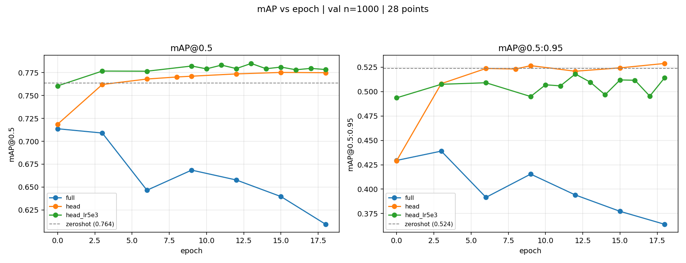

# VOC-Det：目标检测迁移学习的一次受控检验

> 在 Pascal VOC 2012 上检验一个被当作默认动作的问题：**"加载 COCO 预训练模型 → 微调 → 涨点"，在小数据集上真的成立吗？**

**结论：不成立。** 在类别空间完全重叠的迁移场景下，全参微调是**净损害**（峰值 −5.0 点、终点 −15.4 点）；两档学习率的 head-only，净增益都**落在噪声内**（收敛段平均差值 ≤1.9 点）。此前观测到的"mAP@0.5 涨、mAP@0.75 跌"是**学习率过高**造成的，不是 head-only 的固有性质。

| 配置 | 可训参数 | 占比 | mAP@0.5 | mAP@0.75 | mAP@0.5:0.95 |
|---|---|---|---|---|---|
| `zero` 零样本（不训练） | 0 | 0% | 0.7635 | 0.6044 | 0.5238 |
| `head`（head-only）lr=1e-3 @ep15（峰值） | 107,625 | 0.26% | 0.7753 | **0.6148** | 0.5244 |
| `head`（head-only）lr=1e-3 @ep18（终点） | 107,625 | 0.26% | 0.7750 | 0.6067 | **0.5289** |
| `head_lr5e3`（head-only）lr=5e-3 @ep13（峰值） | 107,625 | 0.26% | **0.7851** | 0.5938 | 0.5097 |
| `head_lr5e3`（head-only）lr=5e-3 @ep18（终点） | 107,625 | 0.26% | 0.7784 | 0.5951 | 0.5143 |
| `full` 全参微调 @ep0（峰值） | 41,174,136 | 99.46% | 0.7137 | 0.4702 | 0.4295 |
| `full` 全参微调 @ep18（终点） | 41,174,136 | 99.46% | 0.6093 | 0.3789 | 0.3640 |

> `full` 不是 100% 可训练：torchvision 在加载预训练权重时把 `trainable_backbone_layers` 默认设为 3，因此 `conv1` + `layer1`（共 222,400 个参数）保持冻结，可训练 41,174,136 / 总 41,396,536 = **99.46%**（实测值）。
> 术语说明：本项目早期把"只训 ROI head"称为"线性探针"，但 `FastRCNNPredictor` 里的框回归层占该配置可训练参数的 **80%**，并非线性分类探针，故全文改称 **head-only**（配置代号仍为 `head` / `head_lr5e3`）。详见 [report.md 4.1 节](./report.md)。

> ⚠️ **读数前必看**：以上为 val 前 1000 张子集的结果，经核查**该子集 100% 为 VOC2008 图像**（全量中 2008 仅占 38.1%），**只代表该年份，不能当作"VOC 2012 val"的一般结论**。
> 完整实验设计、机制分析、替代解释与局限声明见 **[report.md](./report.md)**。


*左：mAP@0.5；右：mAP@0.5:0.95。灰虚线为零样本水平线。全参微调（蓝）全程在其**之下**且持续下降；`head`（橙）从 −4.5 点起步，约 4–6 轮后越过水平线；`head_lr5e3`（绿）的 mAP@0.5 最高（13 个点全部高于水平线），但其 mAP@0.5:0.95 的 **13 个点全部落在水平线之下**（0.4936–0.5181）—— 这一分歧由学习率造成，不是 head-only 的固有性质。*

---

## 六条核心发现

**① 全参微调是唯一被证实的损害。** 峰值（ep0）−5.0 点、终点（ep18）−15.4 点，在其 7 个被评估的 epoch 上**无一高于零样本**，18/20 个类退化。train `loss_classifier` 同期降 **57.7%** 而 val mAP 降 **10.4 点** —— 训练目标与泛化方向相反，排除了"训练不充分"的解释。破坏还**不是均匀的**：从 ep0 到 ep18，small 降 **12.8 点**（相对降幅 43.5%）、medium 降 5.5、large 降 5.1 —— **小目标受害最深，与"大目标更难"的直觉相反**。

**② 两档学习率的 head-only，净增益都落在噪声内。** 收敛段（ep6–18）均值相对零样本：lr=1e-3 为 **+0.9 / +0.1 / +0.1 点**，lr=5e-3 为 **+1.7 / −1.8 / −1.7 点** —— 都低于本项目 ±3 点的判定门槛。**能证明的是"全参微调有害"，不能证明"head-only 有用"。**

**③ "检出涨、定位跌"是学习率过高的症状，且不是单轮次偶然。** lr=5e-3 时，mAP@0.5 在 ep6–18 的 **11 个点上全部高于**零样本（+1.3 ~ +2.2 点），mAP@0.5:0.95 **全部低于**（−2.9 ~ −0.6 点），**符号从未翻转**；把 lr 降到 1e-3，两组指标都跨在零样本两侧，分歧消失。**同一个冻结策略、同一批参数，只换学习率就能让结论反转** —— 单一 mAP@0.5 报表看不出这一点。

**④ 换头本身有一次性代价。** 分类头被重新随机初始化后，第 1 轮结束 mAP@0.75 掉 **13.5 点**（是 mAP@0.5 掉幅的 3 倍），需要约 4–6 轮才追平零样本。**"冻结主干"不等于"保住预训练能力"。**

**⑤ 两档 lr 的最优点几乎并列，差别在稳定性。** 逐指标峰值差 ≤1.1 点，但 lr=5e-3 在 mAP@0.75 上的跨度是 **5.1 点**、lr=1e-3 只有 **1.4 点**（3.6 倍）。**准确的说法是"5e-3 更不稳"，不是"5e-3 更差"。**

**⑥ 最重要的实践含义**：动手微调前**先测零样本基线**。若零样本已接近可用精度，微调的增益空间本就极小，而破坏风险始终存在。

---

## 我做了什么

本项目基于 [torchvision](https://github.com/pytorch/vision) 的 `fasterrcnn_resnet50_fpn` 与 [albumentations](https://github.com/albumentations-team/albumentations)。**模型结构、loss 函数、优化器均未改动**，仅替换分类头 —— 这是为了让"微调"这个变量保持干净。

**自己写的部分**（全部在 `scripts/`）：

| 脚本 | 职责 |
|---|---|
| `VOC_detect.py` | 数据集体检：类别 / 密度 / 尺度三个分布（D1） |
| `VOC_dataset.py` | 自写 VOC XML → tensor 的 `Dataset` + `collate_fn` |
| `augment.py` | 数据增强：先手写翻转/缩放验证"框同步"，再封装 albumentations |
| `train.py` | 训练循环：换 21 类头、4 个 loss 分量拆分、checkpoint、续训 |
| `evaluate.py` | 验证循环：torchmetrics mAP（每类同时给 AP@0.5 与 AP@0.5:0.95 两口径）+ 可视化 |
| `baseline_zero_shot.py` | 零样本基线：COCO 权重直接推理 VOC |
| `plot_map_curve.py` / `compare_per_class.py` / `plot_metric_breakdown.py` / `plot_loss_vs_map.py` / `plot_loss.py` | 出图与汇总（脚本内**不写死任何数字**，全部从 `runs/*.json` 读） |

**处理掉的关键陷阱**：VOC 的 `<part>` 部件框（3073 个，仅 person 类）必须忽略，否则框数会从 **40138 变成 43211**；坐标是 1-based 需 `−1`；类别编号 0 被背景占用需 `+1`；默认 `collate_fn` 因图尺寸不同会报 `stack expects equal size`。完整踩坑记录见 [report.md 附录 D](./report.md)。

---

## 快速开始

```bash
conda activate pytorch                      # torch 2.9.0+cu130

python -m scripts.train --mode full         # 全参微调（lr=5e-3）
python -m scripts.train --mode head         # head-only（lr=1e-3）
python -m scripts.train --mode head_lr5e3   # head-only（lr=5e-3，学习率消融）

python baseline_zero_shot.py --n 1000       # 零样本基线
python -m scripts.evaluate --mode full --epochs 0 3 6 9 12 15 18 --n 1000
python -m scripts.evaluate --mode head --epochs 0 3 6 8 9 12 15 18 --n 1000
python -m scripts.evaluate --mode head_lr5e3 --epochs 0 3 6 9 10 11 12 13 14 15 16 17 18 --n 1000

python -m scripts.plot_map_curve --n 1000        # 主结果图 + 汇总表
python -m scripts.plot_metric_breakdown --n 1000 # 多口径拆解图
python -m scripts.plot_loss_vs_map --n 1000      # 训练目标 vs 泛化 背离图
python -m scripts.compare_per_class --n 1000     # 逐类增益图
```

**自检数字**（跑完应对得上）：零样本 mAP@0.5 = 0.7635；`head` 曲线 0.7187（ep0）→ 0.7753（ep15 峰值）→ 0.7750（ep18）；`head_lr5e3` 曲线 0.7606（ep0）→ **0.7851（ep13 峰值，全表最高）** → 0.7784（ep18）；`full` 从 0.7137（ep0）降到 0.6093（ep18）。曲线点数应为 `full` 7 点 / `head` 8 点 / `head_lr5e3` 13 点（合计 28 个评估点）。

---

## 项目结构

```
├── scripts/ 全部脚本（见上表）
├── assets/ 展示图（需提交）
├── outputs/ 产物（已 gitignore）
├── runs/ 权重 / 日志 / metrics（已 gitignore）
├── data/ VOC2012（已 gitignore，1.9 GB）
├── README.md ← 本文：快速了解项目
└── report.md ← 完整实验报告（设计 / 结果 / 机制 / 局限）
```

**项目只保留这两份文档**：`README.md` 用于快速了解，`report.md` 用于完整论证。

---

## 环境

| 组件 | 版本 |
|---|---|
| Python | 3.10（conda env `pytorch`） |
| torch / torchvision | 2.9.0+cu130 / 0.24.0 |
| torchmetrics | 1.9.0 |
| albumentations | 2.0.8 |
| GPU | RTX 5060 Laptop 8 GB / CUDA 13.0 |

> **注意**：RTX 5060 是 Blackwell 架构（sm_120），**需要 cu128 及以上的 wheel**。用 `cu121` 的安装命令会静默装成 CPU 版本。

单次耗时：训练 6.8 min/epoch（峰值显存 3.10 GB）；评估 1000 张约 1.5 min，全量 5823 张约 9 min。

---

## 已知限制

- **评估子集有年份偏差**：1000 张子集 100% 为 VOC2008 图像，所有数字只代表该年份（最严重）
- **学习率未受控，且无法定界**：`full` 用官方 5e-3（为 8 卡 × batch2 = 16 配的），本机单卡 batch=4，理论应约 1.25e-3，**可能偏大 4 倍** → 主结论存在替代解释。`head` / `head_lr5e3` 这组干净消融**不能**用来估计 lr 的破坏力上界 —— 在 0.26% 参数上，lr 提高 5 倍带来的峰值差异只有 0.6–1.1 点，与 `full` 的 −15.4 点不在同一量级
- **单种子**，无误差棒（只押趋势与符号，不押小数点）。**注意**：本项目的核心判断之一（head-only 增益落在噪声内）恰恰是最需要误差棒的那一类结论
- **峰值 epoch 的选取带有选择偏差**：三组候选 epoch 数不同（8 / 13 / 7），但偏差量级 <1 点，低于 ±3 点门槛（`report.md` 6.3 节已补收敛段均值作平行口径）
- **`head` 的 loss 历史缺 ep0–8 段**，因此 loss–mAP 背离图只能用 `head_lr5e3` 完成
- **`head` 与 `head_lr5e3` 都是分两次会话训成的**（ep0–8 + ep9–18 / ep0–9 + ep10–18），`--resume` 只恢复权重、不恢复 SGD 动量；两组曲线在接缝处均无跳变
- **`full` 与 `head` 的超参配置文件缺失**，其超参由报告表格复原而非从产物直接读出
- 无独立 hold-out；未做增强消融；未与 YOLO / DETR 对比

完整局限清单（11 条）与下一步计划见 [report.md 第 8、10 节](./report.md)。

---

## 参考

- Faster R-CNN：<https://github.com/pytorch/vision>
- albumentations：<https://github.com/albumentations-team/albumentations>
- Pascal VOC 2012：<http://host.robots.ox.ac.uk/pascal/VOC/>

## 作者

郗洋 ｜ GitHub：[@xiyang123457](https://github.com/xiyang123457)
