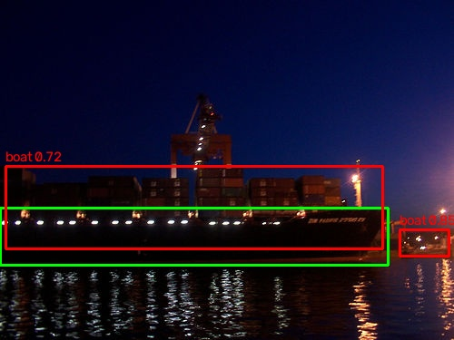

# VOC-Det：Pascal VOC 2012 目标检测微调（Faster R-CNN）

> 在 Pascal VOC 2012（train 5717 图 / 15774 框 / 20 类）上，把 COCO 预训练的 Faster R-CNN 换成 21 类头微调，走通「数据 → 增强 → 训练 → 评估」完整链路。

**结论**：COCO 预训练 Faster R-CNN 微调 5 epoch（中间结果，未收敛），val **mAP@0.5 ≈ 0.71**（1 种子，方差未知；mAP@0.5:0.95 ≈ 0.43）；最强类 bus 0.626，最弱类 pottedplant 0.234。完整实验记录见 [result.md](./result.md)。


*预测可视化：绿框 = GT，红框 = 预测（Faster R-CNN 微调 5 epoch，conf ≥ 0.5）。*

## 结果

| 配置 | mAP@0.5 | mAP@0.5:0.95 | 参数量 | 训练耗时 | 种子数 |
|---|---|---|---|---|---|
| VOC 微调 5 epoch（中间结果） | **≈0.71** | ≈0.43 | 41.2 M | 34 min | 1 |

> 单次实验（1 种子）。多种子方差、逐类 AP 见 result.md 第 4 节。

## 我做了什么

本项目基于 [torchvision](https://github.com/pytorch/vision) 的 `fasterrcnn_resnet50_fpn` 与 [albumentations](https://github.com/albumentations-team/albumentations)。**以下是我自己写的**：

- `scripts/VOC_dataset.py` —— 自写 VOC XML → tensor 的 `Dataset` + `collate_fn`。处理了坐标 1-based（`-1`）、类别编号（背景占 0，`+1`）、`findall` 而非 `iter`（避免钻 `<part>` 多出 3073 个假框）、空图返回 `(0,4)`。
- `scripts/augment.py` —— 先手写水平翻转/缩放公式验证「框同步」，再封装成 albumentations 流水线（`pascal_voc` + `label_fields`）。
- `scripts/train.py` —— 训练循环：换 21 类头（动态取 `in_features=1024`）、`model.train()` 语义、4 个 loss 分量拆分打印、checkpoint、loss 历史落盘。
- `scripts/evaluate.py` —— 验证循环 + torchmetrics 算 mAP（含每类 AP）+ 预测可视化。
- `scripts/VOC_detect.py` —— 数据集体检（类别/密度/尺度三个分布）。

**我没有改动的部分**：模型结构、loss 函数、优化器 —— 直接使用官方实现，只替换分类头，未做魔改。

## 快速开始

```bash
conda activate pytorch
python scripts/train.py        # 训练，约 34 min
python scripts/evaluate.py     # 评估（mAP + 可视化）
```

## 项目结构

```
├── scripts/
│   ├── VOC_detect.py        数据集体检：回答"数据长什么样"
│   ├── VOC_dataset.py       Dataset + collate_fn：回答"数据怎么喂模型"
│   ├── augment.py           增强：回答"框怎么跟着图同步变换"
│   ├── train.py             训练：回答"预训练权重怎么微调到 VOC"
│   ├── evaluate.py          评估：回答"模型好不好（mAP）"
│   ├── visualize_boxes.py   D2 验证：解析的框对不对
│   ├── visualize_aug.py     D3 验证：增强后的框对不对
│   ├── dataloader_test.py   D4 验证：collate 打包对不对
│   ├── plot_loss.py         D6：画 loss 曲线
│   └── time_epoch.py        D5：计时，定 epoch 数
├── assets/                  展示图（demo、fig1、loss_curve、AP 分析图，需提交）
├── outputs/                 产物（已 gitignore）
├── runs/                    权重/日志/metrics（已 gitignore）
├── README.md
└── result.md
```

## 环境

| 组件 | 版本 |
|---|---|
| Python | 3.10（conda env `pytorch`） |
| torch | 2.9.0+cu130 |
| torchvision | 0.24.0 |
| albumentations | 2.0.8 |
| numpy | 2.2.6 |
| opencv-python | 5.0.0 |
| torchmetrics | 1.9.0 |
| matplotlib | 3.10.9 |
| GPU | RTX 5060 Laptop 8.52 GB / CUDA 13.0 |

完整依赖与版本见 [`requirements.txt`](./requirements.txt)。

## 完整复现

```bash
cd /d/target_detection
python scripts/train.py        # 5 epoch，约 34 min
python scripts/plot_loss.py    # → outputs/loss_curve.png
python scripts/evaluate.py     # val 5823 张：mAP + 每类 AP + 预测图
```

- 随机种子：默认（未固定，见 result.md 第 7 节）
- 单次耗时：训练 6.8 min/epoch × 5 ≈ 34 min；评估约 15 min
- 日志与权重：`runs/train.out.log`、`runs/loss_history.json`、`runs/fasterrcnn_*.pth`

## 已知限制

- 单次实验，未做多种子（未报告 mean ± std）
- 未测 COCO 零样本 baseline
- 未做消融（翻转/缩放/颜色增强的各自贡献）
- 未与 YOLO / DETR 对比
- 未做小目标专门优化（VOC 小目标仅 9.5%）
- 失败尝试见 result.md 第 6 节

## 参考

- Faster R-CNN：<https://github.com/pytorch/vision>
- albumentations：<https://github.com/albumentations-team/albumentations>
- Pascal VOC 2012：<http://host.robots.ox.ac.uk/pascal/VOC/>

## 作者

郗洋 ｜ 312659312@qq.com
