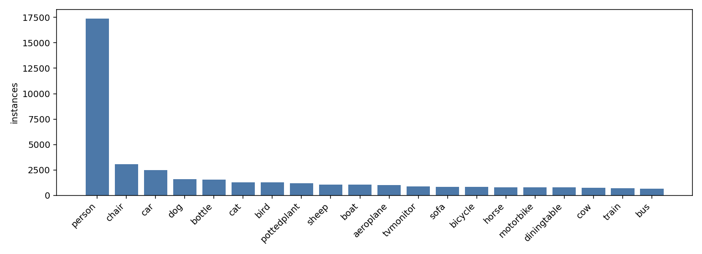
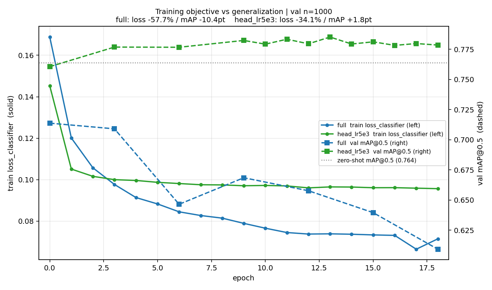
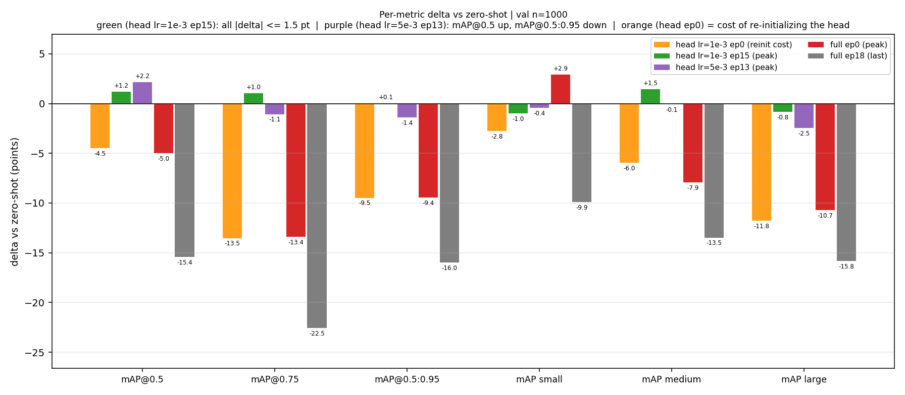
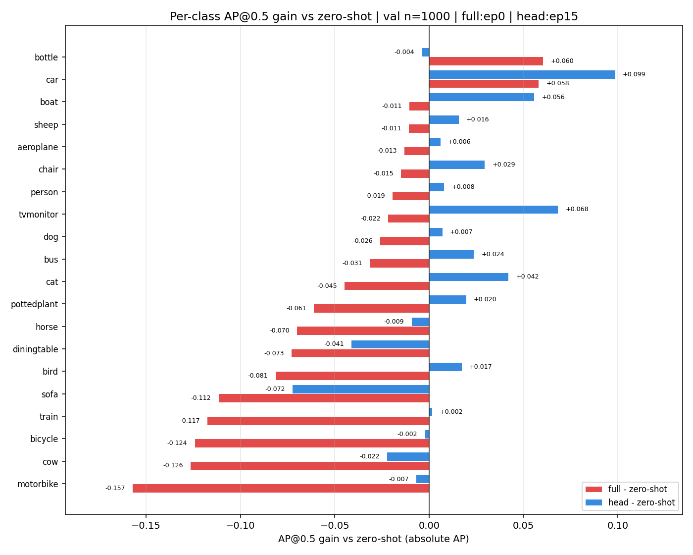

# 微调一定带来增益吗？

## COCO→VOC 目标检测迁移中零样本、head-only 与全参微调的对照研究

> **实验编号**：P1-W2-Ablation ｜ **日期**：2026-09-21
> **代码与原始记录**：`D:\target_detection`（脚本 `scripts/`、指标 `runs/metrics_*.json`、图 `assets/`）
> **评估口径**：torchmetrics `MeanAveragePrecision`（pycocotools 101 点插值），val 前 1000 张固定子集（⚠️ **经核查全部为 VOC2008 图像**，见 3.3 节），`skip_difficult=True`，`min_size=480`
> **一句话结论**：在类别空间完全重叠的迁移场景下，全参微调是**净损害**（峰值 −5.0 点、终点 −15.4 点）；两档学习率的 head-only，其净增益都**落在噪声内**（相对零样本的平均差值 ≤1.9 点）。"mAP@0.5 涨而 mAP@0.5:0.95 跌"只在 lr=5e-3 上出现，且在 11 个收敛后的 epoch 上**无一例外**；lr=1e-3 则没有这一分歧。

---

## 摘要

迁移学习的默认动作是"加载预训练模型 → 微调 → 涨点"。本文在 Pascal VOC 2012 上对该动作做了一次受控检验：把 COCO 预训练的 Faster R-CNN (ResNet50-FPN) 迁移到 VOC，比较四种条件 —— **零样本**（不训练）、**head-only**（只训 ROI head 的预测层，0.26% 参数，两种学习率）、**全参微调**（除 `conv1` + `layer1` 外全部解冻，99.46% 参数，18 轮）。

主要结果：

1. **零样本本就很强**：不做任何训练，mAP@0.5 已达 **0.7635**，mAP@0.5:0.95 达 **0.5238**。
2. **全参微调是净损害**：峰值出现在训练 1 轮之后（0.7137，**−5.0 点**），此后**总体下降**至第 18 轮的 0.6093（**−15.4 点**，中间有 ±2 点的波动，非严格单调）。**18/20 个类退化**。
3. **两档学习率的 head-only，净增益都落在噪声内**。取 ep6–18（两者均已收敛）的平均值：lr=1e-3 相对零样本为 **+0.9 / +0.1 / +0.1 点**（mAP@0.5 / mAP@0.75 / mAP@0.5:0.95），lr=5e-3 为 **+1.7 / −1.8 / −1.7 点**。按本文的判定规则（差异 > 3 点才下结论），**两档都与零样本无显著差异**。
4. **"检出涨、定位跌"只在 lr=5e-3 上成立，且在 11 个 epoch 上无一例外**。lr=5e-3 的 mAP@0.5:0.95 在 ep6–18 的 11 个点上**全部低于零样本**（区间 0.4950–0.5181）；lr=1e-3 的同指标区间是 0.5209–0.5289，**跨在零样本 0.5238 两侧**。本文初版把该分歧归因于"head-only 只提升检出、牺牲定位"，**属过度归因；此处更正为学习率效应**。
5. **换头本身有代价**：分类头被重新随机初始化后，第 1 轮结束时 mAP@0.5 只有 0.7187（**−4.5 点**）、mAP@0.75 只有 0.4692（**−13.5 点**）；head-only 需要约 4–6 轮才追平零样本。**它的最终"增益"是先亏 4.5 点、再赚 5.7 点换来的，净额接近零。**

本文的价值主要不在于结论本身，而在于：(a) 一个常被省略的**零样本锚点**；(b) 对"微调涨点"这一默认动作的**可证伪检验**；(c) 一次**由新增对照三次修正自身中间结论**的过程记录 —— 第一次是补跑 lr=1e-3 全曲线后，把"检出—定位分歧"从"head-only 的性质"改判为"学习率效应"；第二次是再补完 lr=5e-3 全曲线后，把该分歧从"单轮次现象"升级为"11 个 epoch 上一致成立"；第三次是同一批新数据**推翻本文自己上一版给出的"lr 效应量上界"** —— 那个 5.7 点是用 `head` 的峰值对比 `head_lr5e3` 的谷值算出来的，属选择性比较；补全后两档 lr 的峰值差只有 0.6–1.1 点（7.3 节）。

> ⚠️ **读本文前必看**：本文的 1000 张评估子集经实测核查 **100% 为 VOC2008 图像**（全量中 2008 仅占 38.1%）。**所有数字只代表该年份，不能当作"VOC 2012 val"的一般结论**。详见 3.3 节与第 8 节局限第 1 条。

---

## 1. 引言

### 1.1 研究背景与动机

目标检测的实践共识是：用大规模数据集（COCO）预训练，再在小数据集（VOC）上微调。微调几乎是默认动作 —— 它很少被质疑"是否真的必要"。

但当**类别空间完全重叠**时，这个默认动作的前提就动摇了。VOC 的 20 个类在 COCO 的 80 个有效类中 100% 有对应（`aeroplane`→`airplane`、`motorbike`→`motorcycle`、`tvmonitor`→`tv` 等同义映射）。也就是说，COCO 预训练模型**已经认识全部 VOC 类**，迁移中需要解决的只是类别编号的对齐问题，而非语义学习问题。

在"没有新语义要学"的前提下，微调还能带来什么？如果答案接近于零，那么在小数据集上微调反而可能因为**破坏预训练特征**而造成净损害。

### 1.2 研究问题

本文回答三个递进的问题：

| 编号 | 问题 | 需要的对照 |
|---|---|---|
| Q1 | COCO 预训练特征本身有多强？ | 零样本锚点（不训练直接测） |
| Q2 | 微调带来的**净**增益是多少？ | 微调结果 − 零样本结果 |
| Q3 | 冻结策略如何影响结果？ | 全参微调 vs 只训分类头 |

### 1.3 本文贡献

1. **补齐零样本锚点**。多数迁移学习报告只给"微调后 mAP"，读者无法判断这个数字是高还是低。本文给出同口径的零样本基线 0.7635。
2. **把"检出—定位"分歧定位到学习率，并验证它不是单轮次的偶然**。lr=5e-3 时 mAP@0.5 高于零样本、mAP@0.5:0.95 低于零样本，这一符号在 ep6–18 的 **11 个 epoch 上从未翻转**；把学习率降到 1e-3，分歧消失。**单一 mAP@0.5 报表既看不见这个分歧，也看不见它由什么引起。**
3. **量化"换头"这一步的即时代价**。重新初始化分类头会让 mAP@0.75 一次性掉 13.5 点，比 mAP@0.5 的 4.5 点多三倍。**这解释了为什么 head-only 需要数轮才能追平零样本**，也说明"冻结主干就能保住预训练能力"是一个不完整的说法 —— 被丢掉的那一层本身就在承载定位能力。
4. **识别出主要混淆变量并给出证伪路径，同时说明现有对照无法为它定界**。全参微调使用了官方推荐的 lr=5e-3，但该值是为 8 卡 × batch=2（全局 batch 16）配置的；本文单卡 batch=4，理论缩放值应约 1.25e-3。本文明确指出这一混淆，并把它列为**唯一可能推翻主结论的实验**。同时如实报告：`head` 与 `head_lr5e3` 这组干净消融**不能**用来估计 lr 的破坏力上界 —— 在 0.26% 参数上，lr 提高 5 倍带来的峰值差异 ≤1.1 点（7.3 节）。

---

## 2. 相关工作

**迁移学习与微调策略**。检测领域的迁移通常有三档：全参微调、部分层冻结、线性探针（linear probe，只训新分类头）。本文采用的是第三档的工程实现，但该实现同时解冻了分类头里的框回归层，严格说不是线性分类探针 —— 全文改称 **head-only**，理由见 4.1 节的术语说明。这些策略的常见依据是"深度网络的底层特征更通用、高层特征更任务特异，因此冻结策略应越靠近输出层越放开"。但该依据建立在 ImageNet 规模的数据上；**当目标数据集只有数千张图时，这个前提是否成立，需要单独验证**。

**灾难性遗忘**。在小数据集上更新全部参数会使梯度噪声主导更新方向，覆盖预训练学到的通用特征。检测任务中这一现象更隐蔽，因为分类 loss 会持续下降 —— 从 loss 曲线上看"训练很顺利"。

**跨数据集检测迁移**。COCO→VOC 是标准评测协议，文献中 VOC mAP@0.5 通常报告 0.73–0.80（VOC 11 点插值、多卡训练）。本文使用 pycocotools 101 点插值，该口径系统性偏低 1–3 点，**因此本文数字不可与文献数字直接等号比较**。

---

## 3. 数据集与评估协议

### 3.1 Pascal VOC 2012

| 项 | 值 |
|---|---|
| 总规模 | **17125 图 / 40138 个物体框 / 20 类** |
| 训练集（官方 `train.txt`） | 5717 图 / 15774 框 |
| 验证集（官方 `val.txt`） | 5823 图 / 15787 框 |
| `difficult=1` 的框 | 4462（11.1%，评估时忽略） |
| 长尾比 | person 17401 : bus 685 ≈ **25.4 : 1** |
| 尺度分布（COCO 口径） | small **9.5%** / medium 27.6% / large **62.9%** |



**图 1**：VOC 2012 的类别实例数分布呈严重长尾 —— person 一类占全部实例的 43.4%（17401/40138），尾部的 bus 仅 685 个，长尾比 25.4:1。**这意味着总体 mAP 由头部类主导，尾部类的表现必须逐类拆开看才有意义**（见 6.5 节）。

> **数据准备的三个陷阱**（已在 `scripts/VOC_dataset.py` 中处理）：
> ① VOC 的 `Annotations/` 里除了物体框还有 3073 个 `<part>` 部件框（仅 person 类：hand 1507 / head 923 / foot 643）。用 `iter()` 解析会把这些部件当成独立物体，**框数会从 40138 变成 43211**；必须用 `findall("object")`。
> ② 坐标是 1-based，需 `−1`。
> ③ 类别编号 0 被背景占用，VOC 的 20 类需 `+1`。

### 3.2 数据划分与泄漏检查

| 检查项 | 做法 | 结果 |
|---|---|---|
| train/val 重叠 | 使用 VOC 官方划分，按文件名天然不重叠 | ✅ |
| VOC test 污染 | 未触碰 VOC test（其标注未公开） | ✅ |
| 预训练权重与 VOC 的关系 | 权重来自 COCO train2014 | ⚠️ **见下** |

> ⚠️ **一处需要修正的既往判断**。本文档早期版本写"COCO 预训练权重与 VOC 无交集 ✅"。**该判断过于轻率**：VOC 与 COCO 的图像均采集自 Flickr，两者存在图像级重叠的已知风险。VOC 2012 的 XML 中只保留了 `<image>flickr</image>` 这一来源标记，**未保留 flickr id**，因此本文无法在本地完成核对。
> 其后果是：**零样本基线 0.7635 可能被高估**，进而使"微调的净增益"看起来更小。这是本文一个无法排除的系统性风险，已列入第 8 节局限。
> **但需说明优先级**：3.3 节实测确认的**子集年份偏差**（1000 张全部为 VOC2008）是 0.7635 偏高的**更直接解释**。本节所述的重叠风险属于尚未排除、但优先级较低的一项 —— 在补完全量复验之前，不必先假设污染存在。

### 3.3 评估指标与口径

| 项 | 设定 |
|---|---|
| 指标实现 | torchmetrics 1.9.0 `MeanAveragePrecision`（底层 pycocotools，101 点插值） |
| 评估子集 | val 前 **1000 张**（按文件名 `sorted()` 取前 1000，故每次评的是同一批图）｜⚠️ **存在年份偏差，见下** |
| `difficult` 框 | 忽略（`skip_difficult=True`） |
| 输入分辨率 | `min_size=480` / `max_size=800`（零样本与微调**完全一致**） |
| 推理模式 | `model.eval()` + `torch.no_grad()`，不传 `targets` |
| 类别映射（零样本） | COCO 91 类输出按 `VOC_TO_COCO` 映射为 VOC 20 类，映射外的类直接丢弃 |

> 🔴 **子集年份偏差（本文最严重的采样问题，实测确认）**。
> `VOCDataset` 对文件名做 `sorted()`，而 VOC 的文件名以年份开头（`2008_xxxxxx`、`2009_xxxxxx`…），因此 `sorted(val.txt)[:1000]` 取到的是**排在最前的年份**。实测结果：**这 1000 张 100% 是 2008 年份图像**，而全量 5823 张的年份分布是 2008 占 38.1% / 2009 占 23.4% / 2010 占 26.2% / 2011 占 12.3%。
> **后果**：本文所有数字（0.7635 / 0.7851 / 0.6093）**只代表 VOC 2008 这一年的图像，不能宣称是"VOC 2012 val 上的结果"**。年份间的场景、类别配比差异会直接进入数字。
> **症状佐证**：零样本的逐类 AP 出现异常值 —— `sheep` 高达 **0.984**（近完美），而 `aeroplane` 仅 0.729、`sofa` 0.571。同一个模型在语义难度相近的类上出现 0.98 vs 0.57 的落差，**更可能是该年份子集的类别样本量失衡所致，而非模型能力差异**。
> **修法**：改用固定种子的随机子集，或直接跑全量 5823 张（约 9 min）。注意：现有 `meta.subset` 字段只记录布尔值、**不记录"抽的是哪一批"**，若改抽样方式而文件名仍是 `metrics_*_n1000.json`，会**静默覆盖**旧结果 —— 必须把抽样方式写进文件名与 `meta`。

> **口径提醒（本文最容易出错的地方）**：`mAP@0.5` 与 `mAP@0.5:0.95` 是两个不同的量，前者宽松（IoU>0.5 即算命中）、后者严格（IoU 从 0.5 到 0.95 取平均）。本项目早期版本曾把逐类 `AP@0.5:0.95` 误标为 `AP`，并与 `mAP@0.5` 混着比较。**本文所有表格与图均显式标注口径**，同一张表内不混用。

---

## 4. 实验设计

### 4.1 四个实验条件

| 代号 | 可训练参数 | 占比 | lr | epoch | 说明 |
|---|---|---|---|---|---|
| `zero` | **0** | 0% | — | — | COCO 权重直接推理 VOC，不做任何训练 |
| `head` | 107,625 | **0.26%** | 1e-3 | 0–18 | 冻结全部，只训 `roi_heads.box_predictor`；**分两次会话训成**（ep0–8、ep9–18，见 4.3 节）；报 ep15（峰值）与 ep0（起点） |
| `head_lr5e3` | 107,625 | 0.26% | 5e-3 | 0–18 | 同上，学习率敏感性对照；**分两次会话训成**（ep0–9、ep10–18）；报 ep13（峰值） |
| `full` | **41,174,136** | **99.46%** | 5e-3 | 0–18 | torchvision 默认配置（`trainable_backbone_layers=3`：冻结 `conv1` + `layer1`，共 222,400 个参数）；报 ep0（峰值）与 ep18（终点） |

> **术语说明：为什么本文不用"线性探针"这个说法。**
> 该配置的直觉是"在冻结的 COCO 特征上做线性探针"，但 `FastRCNNPredictor(in_features, 21)` 里有两层，都被解冻：
>
> | 层 | 形状 | 参数量 | 占可训练参数 |
> |---|---|---|---|
> | `cls_score`（分类） | (21, 1024) | 21,525 | 20.0% |
> | `bbox_pred`（框回归） | (84, 1024) | 86,100 | **80.0%** |
> | 合计 | | 107,625 | 100% |
>
> **框回归占了 80%**，所以训的不是线性分类探针，而是整个 ROI head 的预测层。全文据此改称 **head-only**（配置代号仍保留 `head` / `head_lr5e3`）。这一改名不只是措辞问题：它解释了 6.1 节里 ep0 的定位指标为什么掉得比检出指标狠三倍 —— 被重新随机初始化的不只是分类层，还有占八成参数的框回归层。

比较口径：**每个配置都在其 mAP@0.5 峰值 epoch 上参与比较**（`head` ep15 / `head_lr5e3` ep13 / `full` ep0），以峰值参与比较可避免"故意挑选最差 epoch 作对照"的质疑。`full` 额外报告 ep18，用于展示退化的幅度；`head` 额外报告 ep0，用于量化换头本身的代价。

**`full` 的可训练参数是实测值，不是推算值**：`fasterrcnn_resnet50_fpn(weights=DEFAULT)` 在传入预训练权重时会把 `trainable_backbone_layers` 默认设为 **3**（不是 5），因此默认就冻结 `conv1` + `layer1`。实测可训练 41,174,136 / 总 41,396,536 = **99.4628%**，被冻结的 11 个参数张量（222,400 个参数）正是这两段。**本文早期版本把该行写成"100%"，与同一行里"仅冻结 conv1+layer1"自相矛盾，现已更正。**

**三组的训练轮数现已一致**（各 19 轮，ep0–18）。`head_lr5e3` 的 ep0–9 与 ep10–18 也是两次会话，与 `head` 情况相同（见 4.3 节）。

`head` 与 `head_lr5e3` 的差别**只有学习率**：同一冻结策略、同一可训练参数量、同一 batch size、同一随机种子。因此两者之差可直接归因于 lr，这是本文唯一一处干净的消融。

### 4.2 受控变量

以下四项在四个条件中完全一致，保证可比性：

- 同一 val 前 **1000 张**（`sorted()` 后的固定顺序）
- 同一 `min_size=480` / `max_size=800`
- 同一 `skip_difficult=True`、`model.eval()` + `no_grad`
- 同一指标实现与落盘格式（零样本脚本直接复用 `evaluate.py` 的 `save_metrics` / `collect_per_class`）

**未受控**：`head`（1e-3）与 `full`（5e-3）的学习率不同。这是本文最重要的未受控变量，见 7.3 节。

**唯一的例外**是 `head` 与 `head_lr5e3` 这一对：同一冻结策略、同一可训练参数量、同一 batch、同一种子，**只差学习率**。它是本文唯一一处干净的单变量消融，6.3 与 7.3 节的 lr 分析都建立在它之上。

### 4.3 实现细节与算力

| 项 | 值 |
|---|---|
| 模型 | `torchvision` `fasterrcnn_resnet50_fpn`，COCO 预训练权重 → 换 21 类头（20 类 + 背景） |
| 换头维度 | 动态取 `in_features=1024`（ROI head 经 `box_head` 后的维度，**不是 backbone 的 2048**） |
| 优化器 | SGD, momentum=0.9, weight_decay=5e-4 |
| batch size | 4（`full`）/ 4（`head`）；评估时 2 |
| 数据增强 | 水平翻转 (p=0.5) + 随机缩放 (0.8–1.2)，**框同步变换** |
| 续训方式 | `--resume` **只加载权重，不恢复优化器状态**（`train.py` 第 180 行只调用 `model.load_state_dict`，未调用 `optimizer.load_state_dict`） |
| 超参落盘 | `head_lr5e3` 的配置文件完整（含续训记录：`epoch_from=10`、`epoch_to=18`、`resume=...epoch9.pth`、`lr=0.005`）；`full` 与 `head` 的配置文件缺失 |
| 硬件 | RTX 5060 Laptop 8 GB / CUDA 13.0 / torch 2.9.0+cu130 |
| 训练耗时 | 6.8 min/epoch（0.287 s/step），峰值显存 3.10 GB |
| 评估耗时 | 1000 张约 80–96 s |

> **`head` 与 `head_lr5e3` 都是分两次会话训成的**。`head` 为 ep0–8 + ep9–18，`head_lr5e3` 为 ep0–9 + ep10–18，第二次都用 `--resume` 接上。这带来两处需要说明的地方：
> ① **SGD 动量在续训点被清零**（续训未恢复优化器状态）。影响可忽略：动量项以 0.9 的衰减率重建，恢复到稳态的 90% 需 22 个 step、95% 需 29 个 step，而一个 epoch 有 1429 个 step，占比约 **2%**。实测两组的指标曲线在接缝处都平滑 —— `head` 在 ep8→ep9 为 0.7703 → 0.7712（mAP@0.5）、0.5232 → 0.5267（mAP@0.5:0.95）；`head_lr5e3` 在 ep9→ep10 为 0.7823 → 0.7792、0.4950 → 0.5070，其 train `loss_classifier` 接缝处为 0.0971 → 0.0972，几乎不动。
> ② **`head` 两段的 lr 是否一致无法从落盘文件直接核对**（`train_config_head.json` 缺失）。间接验证：ep9 的 train `loss_classifier` = 0.1011，高于 `head_lr5e3` 同期的 0.0971（小 lr 收敛更慢，符合预期）；且 ep9→ep18 的 loss 平滑单调下降（0.1011 → 0.0985），与 lr=1e-3 的行为一致。**若两段 lr 不同，曲线上应出现拐点，实测没有。** `head_lr5e3` 不存在这一问题 —— 它的配置文件完整记录了续训参数，两段 `lr=0.005` 一致。

> **环境提示**：RTX 5060 是 Blackwell 架构（sm_120），**需要 cu128 及以上的 wheel**。任务书中 `--index-url .../cu121` 的安装命令在本机不可用，会静默安装到 CPU 版本。

**模型结构与 loss 函数未做任何修改**，仅替换分类头。这一约束是为了让"微调"这一变量保持干净 —— 若同时魔改结构，就无法归因。

> **前期工作**：本文的对照实验建立在 W1 阶段已跑通的链路上（数据 → 增强 → 训练 → 评估）。当时已在 VOC **全量 5823 张**上完成 5 epoch 微调，得 mAP@0.5 ≈ 0.71 / mAP@0.5:0.95 ≈ 0.434。该全量结果**不受 3.3 节年份偏差影响**，但其 epoch 数与本文各配置不同，故未纳入同一张表比较。

---

## 5. 假设与证伪条件

| | 假设 | 证伪条件 |
|---|---|---|
| **H1**（主） | 在 VOC 这种小数据上，全参微调会因破坏预训练特征而**劣于**head-only | 若全参微调的**峰值** mAP@0.5 ≥ head-only 的 mAP@0.5，H1 被推翻 |
| **H2** | COCO 预训练模型在 VOC 上零样本即可达到可用精度（因 20/20 类完全重叠） | 若零样本 mAP@0.5 < 0.30，H2 被推翻 |
| **H3** | 微调的"增益"在严格定位指标（mAP@0.75）上会消失或反转 | 若 mAP@0.75 与 mAP@0.5 同向变化，H3 被推翻 |

**三个假设都给出了可被现有数据推翻的条件**，不存在事后解释空间。这是本文设计的一部分。

**H3 的最终判定（补完两档 lr 全曲线后得出）**：H3 的成立与否由学习率决定，且 lr=5e-3 一档的证据是**统计意义上干净**的。

- **lr=5e-3 上成立，且不是单轮次现象**。在收敛后的 11 个 epoch（ep6–18）上，mAP@0.5 全部高于零样本（+1.3 ~ +2.2 点）、mAP@0.5:0.95 全部低于零样本（−2.9 ~ −0.6 点），**11/11 一致，符号从未翻转**。
- **lr=1e-3 上被推翻**。同口径下 mAP@0.5 为 +0.5 ~ +1.2 点（6/6 为正），mAP@0.75 为 −0.3 ~ +1.0 点、mAP@0.5:0.95 为 −0.3 ~ +0.5 点，**两组指标都跨在零样本两侧**，不存在稳定的方向。

因此 H3 **不能作为关于"head-only"的一般陈述保留** —— 同一个冻结策略、同一份数据、同一批可训练参数，只因为学习率不同，H3 就在一档上稳定成立、在另一档上不成立。6.3 节给出完整数据。

---

## 6. 结果

### 6.1 主结果

| 配置 | epoch | mAP@0.5 | mAP@0.75 | mAP@0.5:0.95 | 相对零样本（@0.5） |
|---|---|---|---|---|---|
| `zero`（不训练） | — | 0.7635 | 0.6044 | 0.5238 | — |
| `head` lr=1e-3（起点） | 0 | 0.7187 | 0.4692 | 0.4292 | −4.5 点 |
| `head` lr=1e-3（峰值） | 15 | 0.7753 | **0.6148** | 0.5244 | +1.2 点 |
| `head` lr=1e-3（终点） | 18 | 0.7750 | 0.6067 | **0.5289** | +1.1 点 |
| `head_lr5e3`（峰值） | 13 | **0.7851** | 0.5938 | 0.5097 | **+2.2 点** |
| `head_lr5e3`（终点） | 18 | 0.7784 | 0.5951 | 0.5143 | +1.5 点 |
| `full`（峰值） | 0 | 0.7137 | 0.4702 | 0.4295 | **−5.0 点** |
| `full`（终点） | 18 | 0.6093 | 0.3789 | 0.3640 | **−15.4 点** |


**图 2**：灰虚线为零样本水平线。左图（mAP@0.5）：`full`（蓝）全程在水平线**之下**且持续下降；`head`（橙）从 −4.5 点起步，约 4–6 轮后越过水平线并缓升至 +1.2 点；`head_lr5e3`（绿）起点比 `head` 高 4.2 点（−0.3 点 vs −4.5 点）、上升更快，在 ep3 即越过水平线，此后在 0.778–0.785 之间震荡、始终高于水平线。右图（mAP@0.5:0.95）：`full` 同样全程低于水平线；`head`（橙）约 6–9 轮后越过水平线并稳定在其上方；**`head_lr5e3`（绿）的 13 个点全部落在水平线之下**（0.4936–0.5181），从未触及 0.5238。

五点观察：

1. **H1 未被推翻，且证据很强**。全参微调的最好状态（0.7137）仍比 head-only（0.7753 / 0.7851）低 **6.2–7.1 点**，且在其 7 个被评估的 epoch 上**无一高于零样本**。
2. **全参微调的峰值出现在 epoch 0**，即**只训练 1 轮就损失了 5.0 点**，此后 18 轮总体恶化。
3. **H3 的成立与否取决于学习率，而 lr=5e-3 那一档的证据现在非常强**。右图中 `head_lr5e3`（绿）在 ep6–18 的 **11 个点上全部低于零样本**，符号从未翻转；`head`（橙）则在零样本两侧摆动。**同一个冻结策略、同一份数据、同一批可训练参数，只因为学习率不同，H3 就在一档上稳定成立、在另一档上不成立。** 详见 6.3 节。
4. **head-only 的曲线形状揭示了一笔此前看不见的账**。`head` 在 ep0 只有 0.7187（−4.5 点）。这不是训练造成的，而是 `build_model` 用 `FastRCNNPredictor(in_features, 21)` **重新随机初始化了整个预测层** —— COCO 那个训练好的头被丢掉了，而零样本基线用的恰恰是它。因此 head-only 不是"从零样本出发涨 1.2 点"，而是"先因换头跌 4.5 点、再用 4–6 轮涨回 5.7 点，净剩 1.2 点"。**换头的代价之所以在定位指标上大三倍（mAP@0.75 −13.5 点 vs mAP@0.5 −4.5 点），是因为被重置的不只是分类层：`bbox_pred` 占了该配置可训练参数的 80%（见 4.1 节术语说明），框回归要从随机权重重新学起，比分类更慢。**
5. **`head_lr5e3` 补训完成后，"两档 lr 最优点几乎一样好"这一点变得清楚**。它的 mAP@0.5 在 ep9–18 上于 0.778–0.785 之间震荡，没有继续上升的趋势 —— 此前"0.7823 是下界而非终值"的担忧可以取消。但补训也带出一个此前无法观察的事实：**lr=5e-3 的收敛点更不稳定**。`head_lr5e3` 的 mAP@0.75 在 ep6–18 上的跨度是 **5.1 点**（0.5574–0.6087），而 `head`（lr=1e-3）只有 **1.4 点**（0.6011–0.6148）；mAP@0.5:0.95 的跨度分别是 2.3 点与 0.8 点。**学习率越高，最优点附近的目标函数越"毛糙"。**

### 6.2 训练动态：训练目标与泛化性能的背离

单看 mAP 下降，无法区分两种完全不同的原因：(a) **训练不充分** —— loss 还没降下去，模型没学好；(b) **泛化 gap** —— 训练集上越学越准，验证集上越来越差。二者的判别方法是把 train loss 与 val mAP 画在一起，看方向是否一致。

| 配置 | train `loss_classifier` | val mAP@0.5 | 方向 |
|---|---|---|---|
| `full` | 0.1688 → 0.0715（**↓57.7%**） | 0.7137 → 0.6093（**↓10.4 点**） | **相反 → 背离** |
| `head_lr5e3` | 0.1453 → 0.0957（↓34.1%） | 0.7606 → 0.7784（**↑1.8 点**） | 相同 → 正常收敛 |



**图 3**：实线为 train `loss_classifier`（左轴），虚线为 val mAP@0.5（右轴）。`full` 的两条线**同向下降** —— 训练目标改善的同时泛化性能恶化；`head_lr5e3` 的两条线**反向**（loss 降、mAP 升），是正常收敛。**这个对照直接排除了"训练不充分"的解释**：若是没学好，train loss 不应持续下降。

> 注：上表中 `head_lr5e3` 的"正常收敛"**仅就 mAP@0.5 这一口径而言**。它的 mAP@0.75 在 ep0–18 之间于 **0.5574–0.6087** 之间来回摆动（极差 5.1 点），**没有单调趋势**，且同期 mAP@0.5:0.95 始终低于零样本 —— 说明它在定位维度上并不稳定。这正是 6.3 节要处理的问题。图 3 只画 mAP@0.5，因此看不出这一层。

补充证据：`full` 的另外三个 loss 分量同样**总体下降**（同样非严格单调）—— `loss_objectness` 0.0238 → 0.0065（↓72.7%），`loss_box_reg` 0.1948 → 0.1106（↓43.2%）。**RPN 的"物体性"判别能力在训练集上持续增强，而验证集上的检测性能持续下降**。

### 6.3 定位精度的独立证据

mAP@0.5 只要求预测框与真值框的 IoU > 0.5（大致套住即可），mAP@0.75 要求 IoU > 0.75（相当贴合）。把 6 个指标拆开看，微调的真实代价才显现。



**图 4**：各配置相对零样本的差值（单位：点）。橙色柱是 `head` 在 ep0 的状态，量化换头本身的代价；绿色柱是 `head` 收敛后（ep15）的净结果；紫色柱是 `head_lr5e3`（ep13）。**绿色与紫色的对比是本图的核心**：两者是同一策略在不同学习率下的收敛结果 —— 绿色 6 个指标全部落在 ±1.5 点内，紫色则在 mAP@0.5 上 +2.2 点、在 mAP@0.5:0.95 上 −1.4 点。**注意本图只取了单个 epoch**，紫色的分歧在其余 10 个 epoch 上同样成立（见下表）。

| 配置 | mAP@0.5 | mAP@0.75 | mAP@0.5:0.95 | small | medium | large |
|---|---|---|---|---|---|---|
| `head` lr=1e-3 @ep0（换头代价） | −4.5 | **−13.5** | −9.5 | −2.8 | −6.0 | −11.8 |
| `head` lr=1e-3 @ep15（峰值） | +1.2 | +1.0 | +0.1 | −1.0 | +1.5 | −0.8 |
| `head` lr=1e-3 @ep18（终点） | +1.1 | +0.2 | +0.5 | +1.6 | +1.6 | −0.5 |
| `head_lr5e3` @ep13（峰值） | **+2.2** | −1.1 | −1.4 | −0.4 | −0.1 | −2.5 |
| `full` @ep0（峰值） | −5.0 | −13.4 | −9.4 | +2.9 | −7.9 | −10.7 |
| `full` @ep18（终点） | −15.4 | −22.5 | −16.0 | −9.9 | −13.5 | −15.8 |

单看一个 epoch 容易被质疑"你挑了对自己有利的那一轮"。把收敛后（ep6–18）的**全部**评估点摊开看，结论比单点更强：

| 指标（相对零样本） | `head` lr=1e-3（6 点） | `head_lr5e3` lr=5e-3（11 点） |
|---|---|---|
| mAP@0.5 | +0.5 ~ +1.2 点，**6/6 为正** | +1.3 ~ +2.2 点，**11/11 为正** |
| mAP@0.75 | −0.3 ~ +1.0 点，4/6 为负 | −4.7 ~ +0.4 点，**10/11 为负** |
| **mAP@0.5:0.95** | −0.3 ~ +0.5 点，3/6 为负 | **−2.9 ~ −0.6 点，11/11 为负** |
| small | −1.4 ~ +1.6 点，5/6 为负 | −3.0 ~ +0.8 点，7/11 为负 |
| medium | −0.5 ~ +1.6 点，0/6 为负 | −0.5 ~ +1.7 点，4/11 为负 |
| large | −1.2 ~ −0.5 点，6/6 为负 | **−4.8 ~ −2.4 点，11/11 为负** |
| mAP@0.5 的绝对值跨度 | 0.7 点 | 0.8 点 |
| mAP@0.75 的绝对值跨度 | 1.4 点 | **5.1 点** |
| mAP@0.5:0.95 的绝对值跨度 | 0.8 点 | **2.3 点** |

**H3 在 lr=5e-3 上稳定成立、在 lr=1e-3 上不成立。** 判据取最严格的那个聚合指标 mAP@0.5:0.95：lr=5e-3 的 11 个点**全部**低于零样本，而 lr=1e-3 的 6 个点跨在零样本两侧。符号从未翻转，因此这不是某一轮的波动。

**"更敢报框，但框更不准"这个说法只适用于 lr=5e-3。** 在 lr=1e-3 下，检出与定位**同步小幅改善**，不存在以定位换检出的交换。把该现象解释为"head-only 的固有性质"是错的。

**两档 lr 的最优点几乎一样好，差别在稳定性。** 逐指标取各自的峰值 epoch：mAP@0.5 为 0.7851（5e-3）vs 0.7753（1e-3）、mAP@0.75 为 0.6087 vs 0.6148、mAP@0.5:0.95 为 0.5181 vs 0.5289 —— **三点差异全部 ≤1.1 点，落在噪声内**。真正的差别是上表中的跨度：**lr=5e-3 在 mAP@0.75 上的波动是 lr=1e-3 的 3.6 倍**（5.1 点 vs 1.4 点）。学习率越高，最优点附近的目标函数越"毛糙"，模型在好点与坏点之间来回摆。**所以"5e-3 更差"这个说法不准确；准确的说法是"5e-3 更不稳"。**

**换头的代价集中在定位**：`head` ep0 的 mAP@0.75 掉 13.5 点，是 mAP@0.5 掉幅（4.5 点）的 **3 倍**。分类头同时承担分类与框回归两件事，重新随机初始化会让两者一起归零；而框回归的重新学习比分类更慢，所以定位指标恢复得最晚。这解释了图 2 右图中橙色曲线为什么要到约 ep6 才越过零样本水平线。

**取收敛段均值，两档 lr 的差别在符号上同样清晰。** ep6–18 的均值相对零样本：lr=1e-3 为 **+0.9 / +0.1 / +0.1 点**，lr=5e-3 为 **+1.7 / −1.8 / −1.7 点**（mAP@0.5 / mAP@0.75 / mAP@0.5:0.95）。**lr=5e-3 的两个严格指标均值都为负，lr=1e-3 则都为正。** 但两组的绝对值都 <2 点，仍低于本文 ±3 点的判定门槛 —— 所以这里得到的是**方向上的结论**（H3 成立与否取决于 lr），不是**幅度上的结论**（head-only 是否有用）。

**尺度上的规律**：把 small / medium / large 三档摊开后，唯一在两档 lr 上都稳定为负的尺度是 **large** —— `head` 为 −0.5 ~ −1.2 点（6/6 为负），`head_lr5e3` 为 −2.4 ~ −4.8 点（11/11 为负），**幅度是前者的 3–4 倍**。small 在两组上都摆动（跨度 3.0 / 3.8 点，大于其均值），属噪声。这与 `full` 的尺度行为**同向但方向相反**：`full` 相对自身的 ep0 是**相对降幅小目标最大**（43.5% vs 18.8% / 10.1%），而 head-only 唯一持续受损的是 large。见 6.4 节。

### 6.4 尺度分解

| 配置 | mAP small | mAP medium | mAP large |
|---|---|---|---|
| `zero` | 0.2655 | 0.3739 | 0.6136 |
| `head` @ep15（峰值） | 0.2555 | 0.3886 | 0.6055 |
| `head` @ep18（终点） | 0.2812 | 0.3902 | 0.6090 |
| `head_lr5e3` @ep13（峰值） | 0.2613 | 0.3732 | 0.5889 |
| `head_lr5e3` @ep18（终点） | 0.2734 | 0.3767 | 0.5893 |
| `full` @ep0 | 0.2946 | 0.2945 | 0.5066 |
| `full` @ep18 | **0.1663** | 0.2392 | 0.4555 |

（口径为 mAP@0.5:0.95）

三点观察：

1. **全参微调对小目标的破坏最严重**：从 ep0 到 ep18，small 降 **12.8 点**、medium 降 5.5 点、large 降 5.1 点。按**相对降幅**看结论一致：small 降 43.5%、medium 降 18.8%、large 降 10.1%。**这与"大目标更好学"的直觉相反** —— 原因可能是小目标的特征本就依赖更精细的底层纹理，而全参微调破坏的正是这部分。
2. **`full` @ep0 的 small 是 +2.9 点（唯一正值）**。这个孤点不应过度解读：VOC 的小目标仅占 9.5%，样本少、方差大；且训练 1 轮后的模型可能更"倾向报框"，在宽松 IoU 下对难检的小目标有短暂收益。**本文不基于这个单点下结论。**
3. **两档 lr 的 head-only，共同点是 large 恒为负，差别在幅度**。`head`（1e-3）的 large 在 −0.5 ~ −1.2 点之间（6/6 为负），`head_lr5e3`（5e-3）在 −2.4 ~ −4.8 点之间（11/11 为负）—— **方向一致，幅度是 3–4 倍**。medium 在两组上都为正或接近零（`head` 6/6 为正，`head_lr5e3` 7/11 为正）；small 在两组上的摆动幅度（3.0 / 3.8 点）都大于其均值，说明**该尺度上的差异落在噪声里**，不应解读为趋势。
4. **与 `full` 的尺度行为形成对照**。`full` 的损害是**全局且以相对降幅论小目标最重**；head-only 的损害是**局部的、只落在 large 上**，且幅度随 lr 放大。large 本已是基线最高的尺度（0.6136），提升空间最小 —— 它的负值可以部分解释为天花板效应，但 5e-3 上 −4.8 点的幅度已超出这一解释。

### 6.5 逐类分析

| 对比 | 平均增益 | 退化类数 |
|---|---|---|
| `head` @ep15 − `zero` | **+1.17 点** | **7 / 20**（sofa, diningtable, cow, horse, motorbike, bottle, bicycle） |
| `head_lr5e3` @ep13 − `zero` | **+2.16 点** | **4 / 20**（cow, diningtable, horse, sofa） |
| `full` @ep0 − `zero` | **−4.98 点** | **18 / 20** |
| `head` @ep15 − `full` @ep0 | **+6.16 点** | **19 / 20**（唯一例外：bottle，−6.4 点） |



**图 5**：红柱为全参微调相对零样本的逐类增益，蓝柱为 head-only（`head` @ep15）相对零样本的逐类增益。**红柱几乎全部在 0 线左侧**（唯一例外是 bottle），且长度随类别变化很大（−15.7 到 +6.0 点）；**蓝柱则紧贴 0 线**，绝对值最大 9.9 点、多数在 ±2 点内。全参微调的退化不是"某几类"的问题，而是**全局性**的。

**head-only 的逐类增益没有稳定方向**：`head` @ep15 在 20 类中 13 类为正、7 类为负，正负两侧幅度都不大。退化最重的两类是 `sofa`（−7.2 点）与 `diningtable`（−4.1 点），它们在 VOC 中的实例数分别只有 840 与 800，属尾部类。这与 6.1 节"平均增益 +1.2 点、落在噪声内"的结论一致：**逐类的正负更可能是采样噪声，而不是"head-only 改善了某些类"**。

**`head_lr5e3` @ep13 的逐类结果与 `head` 同向，但更整齐**：平均 **+2.16 点**、仅 **4/20 类退化**（cow −2.7、diningtable −2.1、horse −0.2、sofa −0.05），且退化的两类主力与 `head` 相同（`cow`、`diningtable` 都是尾部类）。**两档 lr 的逐类结论一致：尾部类承担了大部分退化，头部类几乎不动。** 需要注意 `head_lr5e3` 的平均增益（+2.16 点）仍低于 ±3 点的判定门槛，因此这里能说的是**"逐类结论在两档 lr 下一致"**，而不是"head-only 改善了 16 个类"。

关键类对照：

| 类 | `zero` | `full`@ep0 | `head`@ep15 | `head` − `full` |
|---|---|---|---|---|
| motorbike | 0.948 | 0.791 | 0.941 | **+15.0 点** |
| bicycle | 0.877 | 0.753 | 0.875 | **+12.2 点** |
| train | 0.888 | 0.771 | 0.890 | +11.9 点 |
| cow | 0.777 | 0.651 | 0.755 | +10.4 点 |
| car | 0.795 | 0.853 | **0.893** | +4.1 点 |
| sheep | 0.984 | 0.974 | **1.000** | +2.6 点 |
| bottle | 0.623 | **0.684** | 0.619 | **−6.4 点** |

`head` 那一列把每一类都拉回零样本水平附近（20 类中 13 类略高、7 类略低，幅度多在 ±2 点内），而全参微调把它们全部拉低。`bottle` 是唯一例外 —— 全参微调在它身上有 +6.0 点的增益，head-only 反而略低。考虑到 `bottle` 在 VOC 中只有 1561 个实例（中等偏尾），**这个例外更可能是采样噪声而非真实效应**。

---

## 7. 讨论

### 7.1 为什么零样本如此强

VOC 的 20 类在 COCO 中 **100% 有对应类别**。COCO 模型已经具备全部 VOC 类别的判别能力，迁移中缺少的只是**编号对齐**（COCO 的 91 类输出需要映射到 VOC 的 20 类）。这意味着：

- **没有新的语义需要学习** —— 迁移学习的"知识缺口"本来就很小；
- 因此微调的**理论增益上限很低**，而它引入的**破坏风险却不低**。

这一点对所有"类别重叠度高"的迁移任务都成立，不限于检测。

### 7.2 为什么全参微调是净损害

三条相互印证的证据链：

1. **训练目标与泛化性能方向相反**（图 3）。train loss 降 57.7% 的同时 mAP 降 10.4 点。若是"训练不充分"，train loss 不会持续下降。
2. **退化是全局的**（图 5）。18/20 个类同时退化，且只训一个分类头就能把其中 19 个类的分数拉回零样本附近 —— 说明被破坏的是**共享的底层特征**，而不是某个类别的分类边界。**如果问题只出在分类边界上，改分类头就能修好；事实上改分类头确实几乎修好了，这反过来证明 backbone/FPN 的通用特征才是被全参微调破坏的那一层。**
3. **定位精度损失大于检出损失**（图 4）。mAP@0.75 的退化幅度是 mAP@0.5 的 2.7 倍（−13.4 vs −5.0）。若只是分类头学偏了，定位精度不应受此影响；**只有 backbone/FPN 的回归能力被破坏，才会出现这种"框变松"的模式**。

**规模账**：41.4M 参数在 5717 张图上更新，每个 epoch 仅 1429 个 step。梯度噪声主导更新方向，预训练学到的通用特征被逐步覆盖。这是典型的**灾难性遗忘**。

### 7.3 关键替代解释：学习率混淆

**这是本文最重要的自我质疑。**

| 配置 | lr | 全局 batch | 官方推荐场景 |
|---|---|---|---|
| `full` | **5e-3** | 4 | torchvision 官方值，为 **8 卡 × batch=2 = 16** 配置 |
| `head` | 1e-3 | 4 | 本文自行选择 |
| `head_lr5e3` | 5e-3 | 4 | 与 `full` 对齐，用于隔离 lr 这一项 |

若按线性缩放规则（lr ∝ batch），单卡 batch=4 对应的 lr 应约 **1.25e-3** —— 即 `full` 实际使用的 lr **可能偏大约 4 倍**。

**这意味着一个无法排除的替代解释**：

> 观察到的 −5.0 / −15.4 点退化，可能主要来自**学习率过大**，而非"全参微调本身有害"。

**新增证据（2026-09-21，`head` vs `head_lr5e3` 全曲线）**：这两组是本文唯一一处干净的单变量对照 —— 同一冻结策略、同一可训练参数量、同一 batch、同一种子，只差学习率。两档 lr 都补完了 ep0–18 的全曲线，因此可以分别从**峰值**和**收敛段均值**两个口径比较：

| 口径 | 指标 | `head` lr=1e-3 | `head_lr5e3` lr=5e-3 | 差值 |
|---|---|---|---|---|
| **峰值** | mAP@0.5 | 0.7753（@ep15） | **0.7851**（@ep13） | 5e-3 高 1.0 点 |
| | mAP@0.75 | **0.6148**（@ep15） | 0.6087（@ep16） | 1e-3 高 0.6 点 |
| | mAP@0.5:0.95 | **0.5289**（@ep18） | 0.5181（@ep12） | 1e-3 高 1.1 点 |
| **收敛段均值**（ep6–18） | mAP@0.5 | 0.7722 | **0.7802** | 5e-3 高 0.8 点 |
| | mAP@0.75 | **0.6052** | 0.5860 | 1e-3 高 1.9 点 |
| | mAP@0.5:0.95 | **0.5246** | 0.5068 | 1e-3 高 1.8 点 |

> ⚠️ **对本文上一版的更正**：本报告初版曾用"`head` 的 0.6148 vs `head_lr5e3` 的 0.5574，差 5.7 点"来论证 lr 的效应量足以解释 `full` 的退化。**该证据现已撤回**：0.5574 是 `head_lr5e3` 在 ep0–18 上的**最低点**（ep9），用一组的峰值去比另一组的谷值属选择性比较。补全曲线后，两档 lr 的**峰值**差只有 0.6–1.1 点、**收敛段均值**差 0.8–1.9 点。

这组对照给出三条信息，其中第一条是对本文自身论证的削弱：

- **lr 的效应量在 0.26% 参数上是小的，因此无法为 `full` 的混淆定界**。把 lr 提高 5 倍，最优点差异 ≤1.1 点。**这与 `full` 相对零样本的 −15.4 点相差一个数量级**，所以**不能**再用这组对照论证"lr 足以解释 `full` 的退化"。它反过来支持了一个更保守的判断：**在浅层适配（10.7 万参数）上，lr 的绝对破坏力很小**；若 `full` 的退化真由 lr 造成，就必须假设"同一个 lr 的破坏力随可训练参数量非线性放大"。这个假设本文无法检验。
- **lr 的真实作用是放大方差，而不是压低均值**。两档 lr 的最优点几乎并列，但 `head_lr5e3` 在 mAP@0.75 上的跨度是 5.1 点、`head` 只有 1.4 点，**相差 3.6 倍**（6.3 节表）。lr 越大，最优点附近的目标函数越"毛糙"，模型在好点与坏点之间摆动 —— 这也解释了为什么 `head_lr5e3` 的最差 epoch（0.5574）会那么低：它是震荡的下沿，不是收敛水平。
- **`full` 的 lr 是官方值，不能简单归为"设错了"**。lr=5e-3 是 torchvision 为 8 卡 × batch=2（全局 batch 16）配的推荐值，本文单卡 batch=4 直接沿用了它。按线性缩放规则，理论值应约 1.25e-3。**但 `head_lr5e3` 表明 5e-3 本身并非"数值上必然出错"的学习率** —— 在只训分类头时它拿到全表最高的 mAP@0.5（0.7851）。

**结论**：本文**不能**宣称"全参微调本身有害"，也**不能**用现有的 `head` 消融为 lr 混淆给出上界。只能说：**在 lr=5e-3、单卡 batch=4、仅冻结 `conv1`+`layer1` 的配置下，全参微调相对零样本与 head-only 都是净损害**。要区分"lr 过大"与"全参微调有害"，必须补 `full + lr=1.25e-3` 的对照（见第 10 节）—— **补完全曲线后，这个实验的必要性反而上升了**：它是唯一能同时回答"lr 是否是元凶"和"lr 的破坏力是否随参数量放大"的实验。

---

## 8. 局限（诚实声明）

| # | 局限 | 影响 |
|---|---|---|
| 1 | **评估子集年份偏差**（3.3 节，**实测确认**） | 1000 张子集 **100% 为 VOC2008 图像**（全量中 2008 仅占 38.1%）。**本文所有数字只代表该年份，不能宣称是"VOC 2012 val 上的结果"**；逐类 AP 的异常值（sheep 0.984）疑与此有关 |
| 2 | **学习率未受控**（7.3 节） | 主结论存在替代解释，**尚不能归因于"全参微调本身"**。且本文**无法为这一混淆给出上界**：`head` / `head_lr5e3` 的干净消融（0.26% 参数）显示 lr 的峰值效应 ≤1.1 点，与 `full` 的 −15.4 点相差一个数量级；该对照又不能外推到 41.4M 参数的设定。上一版报告曾据该对照给出"5.7 点上界"，**已撤回** |
| 3 | **单种子，无误差棒** | 所有数字仅 1 次运行（seed=42）。故只报 2 位小数，**结论只押"趋势与符号"，不押小数点**。判断规则：差异 > 3 点才下结论，< 2 点降级为"可比、需多种子确认" |
| 4 | **峰值 epoch 的选取本身带有选择偏差**（4.1 节） | 各配置取各自的 mAP@0.5 峰值参与比较，但三组的候选 epoch 数不同（`head` 8 个、`head_lr5e3` 13 个、`full` 7 个），候选点多的配置有更多机会抽到高点。**量级评估**：`head_lr5e3` 的峰值 0.7851 相对其收敛段均值 0.7802 只高 0.5 点，`head` 的峰值 0.7753 相对均值 0.7722 高 0.3 点 —— 偏差 <1 点，低于本文 ±3 点的判定门槛，**不改变任何结论**。6.3 节已补"收敛段均值"作为平行口径以对冲该偏差 |
| 5 | **无独立 hold-out** | val 同时用于选择 epoch 和报告结果，数字偏乐观 |
| 6 | **COCO↔VOC 图像重叠未排除**（3.2 节） | 零样本基线可能被高估，进而使"微调净增益"看起来更小。**注意**：第 1 条的年份偏差是更直接、且已实测的解释，本条优先级较低 |
| 7 | **`head` 的 loss 历史不完整** | `loss_history_head.json` 只保留了 epoch 9–18，epoch 0–8 段缺失。`head` 是本文的主推配置，这一缺失使它无法进入图 3 的 loss–mAP 对照，该对照只能用 `head_lr5e3` 完成 |
| 8 | **只测了一个数据集对** | COCO→VOC 的类别重叠度是 100%，结论能否推广到低重叠场景未验证 |
| 9 | **未做增强消融** | 翻转/缩放/颜色增强各自的贡献未分离 |
| 10 | **`head` 的两次会话未恢复优化器状态**（4.3 节） | `--resume` 只加载权重，SGD 动量在 ep9 处被清零。影响评估为可忽略（动量恢复到稳态 90% 需 22 个 step，一个 epoch 有 1429 个 step，占比约 2%；指标曲线在 ep8→ep9 无跳变），但**未做对照实验直接验证** |
| 11 | **`full` 与 `head` 的超参配置文件缺失** | 仅 `head_lr5e3` 的 `train_config` 落盘。`full` / `head` 的超参只能由本报告 4.1 节的表格与附录 A 的命令复原，**不是从实验产物直接读出的** |

**关于第 3 条的判断规则**：本文用 ±3 点作为"下结论"的门槛，是基于单种子实验的保守估计。据此：

- **可下的结论**：全参微调总体下降 15.4 点、18/20 类退化（远超阈值）；两档 lr 的 head-only 净增益都不足 2.2 点（低于阈值）；H3 在 lr=5e-3 上 11/11 符号一致（这是**符号**证据，不依赖幅度）。
- **不可下的结论**：`head` 相对 `zero` 的 **+1.2 点**、`head_lr5e3` 相对 `zero` 的 **+2.2 点**，以及 `head_lr5e3` 的 mAP@0.75 均值 **−1.8 点** —— 全部低于阈值。而这恰恰是本文关于 head-only 的核心判断 —— 它落在**不能下结论**的那一类。换句话说：**head-only 既没有被证明有用，也没有被证明有害；能被证明的只有全参微调的净损害。**

---

## 9. 结论

1. **H1 未被推翻**。全参微调的峰值（0.7137）低于 head-only（0.7753 / 0.7851）**6.2–7.1 点**，且在其 7 个被评估的 epoch 上**无一高于零样本**。
2. **H2 成立**。COCO 预训练模型在 VOC 上零样本 mAP@0.5 = 0.7635，远超 0.30 的阈值，直接说明"类别空间完全重叠时，迁移几乎不需要学习"。
3. **H3 的成立与否取决于学习率，且两档的结论都很干净**。lr=5e-3 时，mAP@0.5 在 ep6–18 的 **11 个点上全部高于**零样本（+1.3 ~ +2.2 点），mAP@0.5:0.95 **全部低于**零样本（−2.9 ~ −0.6 点），符号从未翻转，H3 稳定成立；lr=1e-3 时两组指标都跨在零样本两侧（mAP@0.75 −0.3 ~ +1.0 点、mAP@0.5:0.95 −0.3 ~ +0.5 点），H3 被推翻。**"检出—定位分歧"不是 head-only 的性质，而是学习率过高的症状。**
4. **两档 lr 的最优点几乎并列，真正的差别是稳定性**。逐指标峰值差 ≤1.1 点（0.7851 vs 0.7753 / 0.6087 vs 0.6148 / 0.5181 vs 0.5289），但 lr=5e-3 在 mAP@0.75 上的跨度是 **5.1 点**、lr=1e-3 只有 **1.4 点**（3.6 倍）。**准确的说法是"5e-3 更不稳"，不是"5e-3 更差"。**
5. **head-only 的净增益落在噪声内**。正确学习率下 6 个指标全部落在 ±1.5 点内，收敛段均值也不超过 2 点，低于本文 ±3 点的判定门槛。**本文能证明的是"全参微调有害"，不能证明"head-only 有用"。**
6. **换头有一次性代价**。重新随机初始化分类头会让 mAP@0.75 立刻掉 **13.5 点**，需要约 4–6 轮才追平零样本。**"冻结主干"并不等于"保住预训练能力"** —— 被丢弃的那个分类头本身也在承载定位能力。
7. **最重要的实践含义**：**"先微调再说"不是安全的默认动作**。在动手微调前，应当先测零样本基线 —— 如果零样本已经接近可用精度，微调的增益空间本就极小，而破坏风险却始终存在。

---

## 10. 后续工作

按优先级排序：

| 优先级 | 实验 | 目的 |
|---|---|---|
| **P0** | **改用固定种子随机子集（或全量 5823 张）重评三方** | **排除 3.3 节的年份偏差 —— 本文最严重的采样问题**。全量约 9 min |
| **P0** | `full + lr≈1.25e-3`（6 epoch） | **排除学习率混淆 —— 唯一可能推翻主结论的实验**。⚠️ 补完 `head_lr5e3` 全曲线后，这个实验的**必要性上升**：现有的干净消融（0.26% 参数）显示 lr 的峰值效应 ≤1.1 点，无法为 `full` 的 −15.4 点定界，反而使"lr 破坏力随参数量放大"成为必须直接检验的假设。⚠️ 实施前须先改两处代码：`train.py` 的 `elif mode == "full"` 会拒绝新的 mode 名，`evaluate.py` 的 checkpoint 名正则不含下划线、会把它解析成 `unknown` |
| **P1** | 3 种子重跑，报 mean ± std | 给所有数字补上误差棒。**优先级高于此前**：本文对 head-only 的核心判断（增益落在噪声内）正是最需要误差棒的那一类结论；且"两档 lr 最优点并列、差别在稳定性"这一判断，目前只有单次运行的跨度作支撑 |
| P2 | **warm-start 换头**：用 COCO 权重按 VOC 类切片初始化预测层，而非随机初始化 | **分离"换头代价"与"训练收益"**。做法：`cls_score.weight` 取 COCO 的 20 个 VOC 类对应行；`bbox_pred.weight` 先 reshape 成 (91, 4, 1024) 再取同样的 20 行、展平为 (80, 1024)。这样 ep0 就不再是"随机头"，6.1 节那笔 −4.5 / −13.5 点的一次性代价可以被直接消掉或量化。⚠️ 注意：不能反过来做"冻结 `bbox_pred`、只训 `cls_score`"—— 换头后 `bbox_pred` 的形状从 (364, 1024) 变为 (84, 1024)，COCO 权重根本无法沿用，冻结一个随机初始化的框回归层只会输出乱框 |
| P2 | 手写 VOC 11 点 AP 与 torchmetrics 对拍 | 确认指标实现无误 |
| P3 | 缩小子数据集（如 1000 张）观察退化是否加剧 | 若加剧，则直接支持"小数据导致遗忘"的机制 |
| P3 | 换低类别重叠度的数据集（具身场景小数据集） | 检验结论的边界条件 |
| P3 | 加 lr scheduler（如 cosine 或 step） | 检验"mAP@0.75 在 lr=5e-3 下震荡 5.1 点"能否被 lr 退火压下去。若能，则 6.3 节的"稳定性差异"就有了可操作的对策，而不只是一个观察 |

> `head_lr5e3` 的续训（原 P1）已于 2026-09-21 完成：ep10–18 用 `--resume` 从 `epoch9.pth` 接上，三组的训练轮数现已一致（各 19 轮）。

---

## 附录 A · 复现命令

```bash
cd /d/target_detection
conda activate pytorch          # torch 2.9.0+cu130（RTX 5060 为 sm_120，需 cu128+）

# 1) 训练：--mode 决定冻结策略，--lr / --epochs 按需覆盖默认值
#    注意：只有 head_lr5e3 的配置落盘在 runs/train_config_head_lr5e3.json，
#    full / head 的配置文件缺失（见第 8 节局限第 11 条）—— 它们的超参见 4.1 节表格
python -m scripts.train --mode full         # 全参微调（lr=5e-3）
python -m scripts.train --mode head         # head-only（lr=1e-3）
python -m scripts.train --mode head_lr5e3   # head-only（lr=5e-3）
# 续训（head 的 ep9–18、head_lr5e3 的 ep10–18 即由此而来；⚠️ 只恢复权重，不恢复优化器状态）：
# python -m scripts.train --mode head --resume runs/fasterrcnn_resnet50_fpn_voc_head_epoch8.pth
# python -m scripts.train --mode head_lr5e3 --resume runs/fasterrcnn_resnet50_fpn_voc_head_lr5e3_epoch9.pth

# 2) 评估（--n 0 表示全量 5823 张；--epochs 指定要评哪些 checkpoint）
python baseline_zero_shot.py --n 1000
python -m scripts.evaluate --mode full --epochs 0 3 6 9 12 15 18 --n 1000
python -m scripts.evaluate --mode head --epochs 0 3 6 8 9 12 15 18 --n 1000
python -m scripts.evaluate --mode head_lr5e3 --epochs 0 3 6 9 10 11 12 13 14 15 16 17 18 --n 1000

# 3) 出图与汇总（本报告全部图表由以下脚本生成，脚本内不写死任何数字）
python -m scripts.plot_map_curve --n 1000        # → fig_map_curve_n1000.png + summary_n1000.csv
python -m scripts.compare_per_class --n 1000     # → fig_per_class_delta_n1000.png + per_class_3way_n1000.csv
python -m scripts.plot_metric_breakdown --n 1000 # → fig_metric_breakdown_n1000.png
python -m scripts.plot_loss_vs_map --n 1000      # → fig_loss_vs_map_n1000.png
```

**自检数字**（跑完应对得上）：

| 检查项 | 期望值 |
|---|---|
| 零样本 mAP@0.5 / mAP@0.5:0.95 | 0.7635 / 0.5238 |
| `head` mAP@0.5 曲线 | 0.7187（ep0）→ 0.7753（ep15 峰值）→ 0.7750（ep18） |
| `head_lr5e3` mAP@0.5 曲线 | 0.7606（ep0）→ 0.7851（ep13 峰值，**全表最高**）→ 0.7784（ep18） |
| `full` mAP@0.5 | 0.7137（ep0 峰值）→ 0.6093（ep18） |
| 曲线点数 | `full` 7 点 / `head` 8 点 / `head_lr5e3` 13 点（合计 28 个评估点） |
| `head_lr5e3` mAP@0.5:0.95 全段 | 13 点全部 < 0.5238（零样本），区间 0.4936–0.5181 |
| 逐类 CSV 的 AP 列非空行数 | 三个 AP 列各 20 行（脚本末尾自检会打印 ✓） |

---

## 附录 B · 完整逐类 AP@0.5 对照（val n=1000）

三个来源均取各自的峰值 epoch：`zero`（无轮次）、`full` @ep0、`head` @ep15。

| 类 | `zero` | `full`@ep0 | `head`@ep15 | `head` − `full` | `head` − `zero` |
|---|---|---|---|---|---|
| bottle | 0.623 | 0.684 | 0.619 | −0.064 | −0.004 |
| aeroplane | 0.729 | 0.716 | 0.735 | +0.019 | +0.006 |
| sheep | 0.984 | 0.974 | 1.000 | +0.026 | +0.016 |
| person | 0.927 | 0.907 | 0.935 | +0.027 | +0.008 |
| diningtable | 0.391 | 0.318 | 0.350 | +0.032 | −0.041 |
| dog | 0.834 | 0.808 | 0.841 | +0.033 | +0.007 |
| sofa | 0.571 | 0.459 | 0.499 | +0.039 | −0.072 |
| car | 0.795 | 0.853 | 0.893 | +0.041 | +0.099 |
| chair | 0.613 | 0.598 | 0.643 | +0.045 | +0.029 |
| bus | 0.766 | 0.735 | 0.789 | +0.055 | +0.024 |
| horse | 0.926 | 0.856 | 0.916 | +0.061 | −0.009 |
| boat | 0.591 | 0.581 | 0.647 | +0.066 | +0.056 |
| pottedplant | 0.616 | 0.555 | 0.636 | +0.081 | +0.020 |
| cat | 0.878 | 0.833 | 0.920 | +0.087 | +0.042 |
| tvmonitor | 0.654 | 0.632 | 0.722 | +0.090 | +0.068 |
| bird | 0.882 | 0.801 | 0.899 | +0.099 | +0.017 |
| cow | 0.777 | 0.651 | 0.755 | +0.104 | −0.022 |
| train | 0.888 | 0.771 | 0.890 | +0.119 | +0.002 |
| bicycle | 0.877 | 0.753 | 0.875 | +0.122 | −0.002 |
| motorbike | 0.948 | 0.791 | 0.941 | +0.150 | −0.007 |
| **均值** | **0.7635** | **0.7137** | **0.7753** | **+0.0616** | **+0.0117** |

> 逐类均值与 `overall` 的 `map_50` 完全一致（差 < 0.001），说明解析与对齐无误。原始表见 `runs/per_class_3way_n1000.csv`。
> 本表取三个来源各自的峰值 epoch（`head` @ep15 / `full` @ep0）。`head_lr5e3` @ep13 的逐类结果可用 `python -m scripts.compare_per_class --modes zeroshot full head head_lr5e3` 生成；其结论与 `head` 同向但更整齐（16/20 为正、4/20 为负，平均 **+2.16 点**，最差为 cow −2.7 点），本文正文在 6.5 节说明，不单独列表。

---

## 附录 C · 结果可信度自查

| 检查项 | 做法 | 结果 |
|---|---|---|
| 数据泄漏 | VOC 官方 train/val 划分，按文件名天然不重叠 | ✅ |
| 测试集污染 | 未触碰 VOC test | ✅ |
| 预训练权重污染 | COCO 与 VOC 可能存在图像级重叠，**无法本地核对** | ⚠️ **未排除** |
| 评估模式 | `model.eval()` + `no_grad` + 不传 `targets` | ✅ |
| 三方口径一致 | 同一 n=1000 子集、同一 `min_size`、同一指标实现 | ✅ |
| 逐类均值 vs overall | 三个来源均对得上（差 < 0.001） | ✅ |
| 零样本类别映射 | `VOC_TO_COCO` 20 项已逐条人工核对 | ✅ |
| 对照公平性 | 三个配置均取各自的**峰值** epoch 参与比较 | ✅ |
| 换头代价已隔离 | `head` ep0 单独报告，与训练收益分开算 | ✅ |
| 学习率受控 | `full` 与 `head` 的 lr 不同 | ❌ **未受控，且无法定界**（`head`/`head_lr5e3` 对照的 lr 峰值效应仅 ≤1.1 点，与 `full` 的 −15.4 点不在同一量级） |
| 训练过程连续性 | `head`（ep0–8 + ep9–18）与 `head_lr5e3`（ep0–9 + ep10–18）均分两次会话，`--resume` 未恢复优化器状态 | ⚠️ 两组的指标与 loss 曲线在接缝处均无跳变，影响评估为可忽略，但未做对照直接验证 |
| 训练轮数一致性 | 三组均为 ep0–18（各 19 轮） | ✅ 此前 `head_lr5e3` 只训到 ep9 的问题已解决 |
| 超参可追溯性 | 仅 `head_lr5e3` 的配置文件落盘 | ⚠️ `full` / `head` 的超参由本报告表格复原，非从产物直接读出 |
| 峰值选取偏差 | 三组候选 epoch 数不同（8 / 13 / 7） | ⚠️ 偏差量级 <1 点，低于 ±3 点门槛；6.3 节已补收敛段均值作为平行口径 |
| 随机性 | 单种子，无 std | ❌ |
| 独立 hold-out | 无，val 兼作报告集 | ❌ |
| 指标实现 | 未与手写 AP 对拍 | ⚠️ 待补 |

---

## 附录 D · 工程踩坑记录

> 这一节不支撑正文的任何结论，但它说明**数字为什么可信** —— 下列每一处都曾让结果"看起来正常、实则错误"。

### D.1 任务书预警过、实测确实会踩的坑

| 坑 | 实际现象 | 处理 |
|---|---|---|
| 微调检测器 lr 从 1e-4 起步 | 1e-4 是 Adam 风格的量级；SGD 官方配置是 5e-3，实测 loss 正常下降 | 改用 5e-3 |
| `collate_fn` 没自定义 | 默认 collate 因图尺寸不同报 `stack expects equal size` | 自写 `zip(*batch)` |
| 类别 id 与背景错位 | 忘 `+1` 时 loss 看着正常但模型学不会 | `_parse_xml` 里已 `+1` |
| 评估忘了 `model.eval()` | 会让 mAP 异常（BN/Dropout 未切到推理模式） | `evaluate.py` 显式 `eval() + no_grad` |
| 增强时框没跟着变换 | 手写 resize 曾把 w/h 传反 → 图被拉伸 | 已改，且每一步都画图目视验证 |
| 只看总 mAP 不看逐类 | 总 mAP 掩盖了 `pottedplant` 的极低分 | 打印并分析每类 AP（两个口径都给） |
| 逐类 AP 标错口径 | 把 `map_per_class` 当成 AP@0.5，还与 mAP@0.5 混着比 | 代码同时输出两口径；文档与图表统一标注 |

### D.2 任务书未预警、额外踩到的坑

| 坑 | 现象 | 根因 | 处理 |
|---|---|---|---|
| `pretrained=True` | 弃用警告 | torchvision 0.24 改为 `weights=` | 已改 |
| 误以为 `in_features=2048` | 换头维度错 | ROI head 经 `box_head` 后是 **1024**，不是 backbone 的 2048 | 改为动态取 |
| `num_workers=2` | Windows 下有卡死风险 | `spawn` + 共享内存 | 改回 0 |
| albumentations import 崩溃 | import 时联网查版本超时 | 访问 pypi | 设 `NO_ALBUMENTATIONS_UPDATE=1` |
| `collate_fn` 定义了两份 | 维护隐患 | Dataset 与测试脚本各一份 | 合并到 `VOC_dataset.py` |
| `sorted(val.txt)[:1000]` | **子集 100% 是 VOC2008** | 文件名以年份开头，`sorted()` 等价于按年份排序 | **未修**，已作为局限第 1 条声明（3.3 节） |

### D.3 一条方法论教训

**任务书是规划文档，不是 API 文档。** 任务书写"batch 里 img 是 `tensor[B,3,H,W]`"，但实测 torchvision 0.24.0 的签名是 `FasterRCNN.forward(images: list[Tensor], ...)` —— **是 list，不是堆叠张量**。根因：`[B,3,H,W]` 是分类任务的直觉，而检测任务每张图尺寸可不同，摞不成堆叠张量。
→ **凡涉及具体接口，一律先实测再照做。**

---

*报告完成于 2026-09-21 ｜ 作者：郗洋（[@xiyang123457](https://github.com/xiyang123457)）｜ 全部数字可由附录 A 的命令复现*

*同日修订：补跑 `head`（lr=1e-3）的完整 8 点曲线后，修正了摘要第 3–5 条、6.1、6.3、6.5、7.3、8、9 节的结论。初版把"mAP@0.5 涨而 mAP@0.75 跌"归因于 head-only 的性质，现更正为学习率过高的症状；H3 由"成立"改为"在 lr=5e-3 上成立、在 lr=1e-3 上被推翻"。*

*同日二次修订：核对复现链路时发现两处需要声明的事实 —— ① `train.py --resume` 只加载权重、不恢复优化器状态，而 `head` 的曲线横跨两次训练会话（4.3 节与局限第 10 条）；② `full` 与 `head` 的超参配置文件缺失（局限第 11 条）。两处均不影响结论，已写入局限与附录 C。*

*同日三次修订：`head_lr5e3`（lr=5e-3）的 ep10–18 补训完成，三组训练轮数现已一致（各 19 轮），评估点由 3 个增至 13 个。据此改动：① 摘要第 3–4 条、1.3、5 节 H3 终判、6.1–6.5、9 节全部换用全曲线数据；② H3 在 lr=5e-3 上的证据由"单点 +1.9/−4.7"升级为"ep6–18 共 11 个点符号一致"；③ **撤回上一版给出的"lr 效应量上界 = 5.7 点"** —— 该数字是 `head` 峰值对比 `head_lr5e3` 谷值所得，补全曲线后两档 lr 的峰值差只有 0.6–1.1 点（7.3 节）；④ 由此新增一条结论：两档 lr 的最优点几乎并列，差别在稳定性（mAP@0.75 跨度 5.1 点 vs 1.4 点）；⑤ 局限第 4 条由"训练轮数不一致"替换为"峰值选取偏差"。*

*同日四次修订：项目评审后逐条核实，改了两处事实性错误与一处术语。① **`full` 的可训练参数由"100%"更正为实测的 99.46%**（41,174,136 / 41,396,536）—— 原表述与同一行"仅冻结 `conv1`+`layer1`"自相矛盾，实测确认冻结的正是这两段共 222,400 个参数，根因是 torchvision 在加载预训练权重时把 `trainable_backbone_layers` 默认设为 3；② **术语"线性探针"全文改为 head-only**，因为 `FastRCNNPredictor` 的 `bbox_pred` 占该配置可训练参数的 80%，并非线性分类探针 —— 这一更正同时给出了 6.1 节 ep0 定位指标掉幅三倍的机制解释；③ 修正 `scripts/plot_loss_vs_map.py` docstring 中一组过期数字（仍写着 ep9 时代的 0.0971 / 0.7823 / 33.2%）；④ 修正 `scripts/dataloader_test.py` 与附录 D 的冲突（该脚本残留 `NUM_WORKERS=2` 并自带一份重复的 `collate_fn`）。另核实评审提出的"零样本评估不对等"不成立：mAP 逐类计算，非 VOC 类的检测框既非 TP 也非 FP，丢弃它们不减免惩罚，而不丢弃反而会把无 GT 的类算成 AP=0。*
